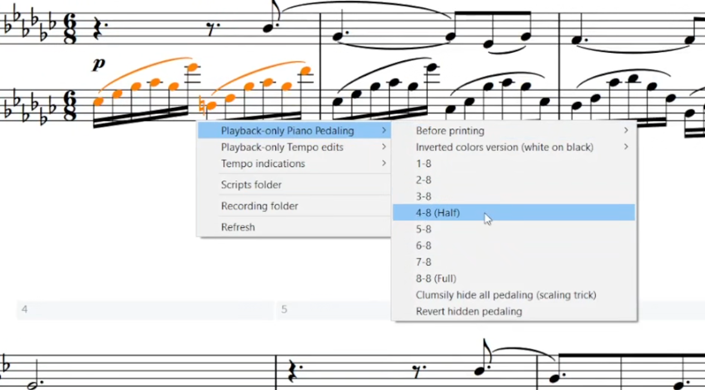

# Dorico Script Launcher

[AHK](https://www.autohotkey.com/) script to manage and launch [_Lua_](https://en.wikipedia.org/wiki/Lua_(programming_language)) scripts in [_Dorico Pro 4_](https://www.steinberg.net/dorico/).

  

## Current features

* Popup menu triggered with middle mouse button to launch scripts in _Dorico_.
* Put _Lua_ scripts into subfolders for better organization.
* Custom user hotkeys to launch your scripts.

## Installation

Download the ZIP file from this repository and extract it anywhere in your computer.

Then launch "_Dorico Script Launcher.ahk_".

In _Dorico_, set your preferred shortcut for opening the _Dorico_ console, which will then be used by this script:
* _Edit_ → _Preferences_ → _Key Commands_ → _Script_ → _Show Console_;
* Assign a shortcut that doesn't interfere with your workflow;
* Edit the AHK script _include/user_settings.ahk_ (e.g. with _Notepad++_);
* Set `hotkey_to_open_dorico_console` to the chosen hotkey ([AHK hotkeys instructions](https://www.autohotkey.com/docs/Hotkeys.htm)).

This method is better than traversing the _Dorico_ menu via key presses because if you move the mouse you can interfere with the process.

The script's popup menu is set to open with the middle mouse button (`MButton`).

For this reason, you can't move the page with the same button: you can however simply use _Shift + left click_ for that functionality. You can change the hotkey for the menu anyway in "_Dorico Script Launcher.ahk_".

To define hotkeys specifically for the various _Lua_ scripts, edit the _AHK_ script _include/user_hotkeys.ahk_ and add your hotkeys specifying the relative path of the scripts.

## Contributing

While anything is welcome, don't focus on the example _Lua_ scripts, those are there just for demonstration.

